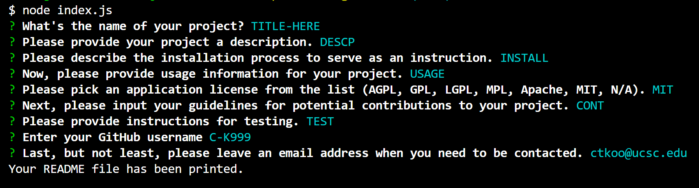

# README Generator
What does a high-quality README app need? A description of what the app is for? How to install it? Who to contact in order to report issues? How would people make contributions? The purpose of this app is to incldue all of the above options, for when the user requires a shortcut to help generate a professional README document writeup using command-line application.

## Table of Contents

- [Technologies](#technologies)
- [Code Snippets](#code-snippets)
- [Software Demo](#demo)
- [Credits](#credits)
  

## Technologies Used
- Javascript
- Node.js
- jQuery


## Code Snippets
The following snipept is a showcase of the Inquirer NPM package, and how it's precisely used in order to make the code function. In order to make sure everything a professional README document requires for an open-source project has been included, a total of 9 prompts have been prepared.
```java
inquirer
    .prompt([
        {
            type:'input',
            message:"What's the name of your project?",
            name: 'title'
        },
        {
            type: 'input',
            message: 'Please provide your project a description.',
            name: 'description'
        },
        {
            type: 'input',
            message: 'Please describe the installation process to serve as an instruction.',
            name: 'installation'
        },
        {
            type: 'input',
            message: 'Now, please provide usage information for your project.',
            name: 'usage'
        },
        {
            type: 'input',
            message: 'Please pick an application license from the list (AGPL, GPL, LGPL, MPL, Apache, MIT, N/A).',
            name: 'license',
            choices: ['AGPL', 'GPL', 'LGPL', 'MPL', 'Apache', 'MIT', 'N/A']
        },
        {
            type: 'input',
            message: 'Next, please input your guidelines for potential contributions to your project.',
            name: 'contribution'
        },
        {
            type: 'input',
            message: 'Please provide instructions for testing.',
            name: 'test'
        },
        {
            message: "Enter your GitHub username",
            name: "username"
        },
        {
            type: 'input',
            message: "Last, but not least, please leave an email address when you need to be contacted.",
            name: "email"
        },
    ])
```
Additionally, the second to last prompt is an integration of the axios package. It was used to fetch a variety of information from the user through the Github API by prompting their username.
```java
	axios.get(queryUrl).then(function(res) {
		.
		.
		.
		readName = res.data.name;
		.
		.
		.
	}
```

## Demo

<br>

<br>

## Credits

UCB - Coding Bootcamp


## License

[](https://opensource.org/licenses/MIT)

---

© 2022 Clement Koo. All Rights Reserved.
[LinkdIn](https://www.linkedin.com/in/clement-t-k-459322138/) |
[GitHub](https://github.com/C-K999)
